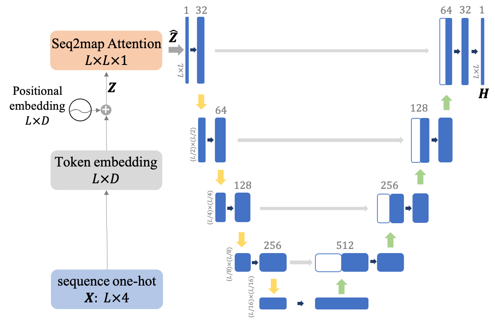
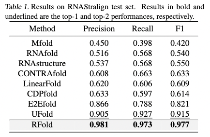
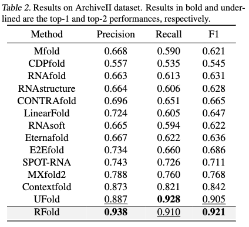

# RFold: RNA Secondary Structure Prediction with Decoupled Optimization

   <!--  -->

## Introduction

The secondary structure of ribonucleic acid (RNA) is more stable and accessible in the cell than its tertiary structure, making it essential for functional prediction. Although deep learning has shown promising results in this field, current methods suffer from poor generalization and high complexity. In this work, we present RFold, a simple yet effective RNA secondary structure prediction in an end-to-end manner. RFold introduces a decoupled optimization process that decomposes the vanilla constraint satisfaction problem into row-wise and column-wise optimization, simplifying the solving process while guaranteeing the validity of the output. Moreover, RFold adopts attention maps as informative representations instead of designing hand-crafted features. Extensive experiments demonstrate that RFold achieves competitive performance and about eight times faster inference efficiency than the state-of-the-art method.

## Model overview

We show the overall RFold framework.

<p align="center">
  
</p>

## Benchmarking

We comprehensively evaluate different results on the RNAStralign, ArchiveII datasets.

<p align="center">
  
</p>

<p align="center">
  
</p>

## Colab demo

We provide a Colab demo for reproducing the results and testing RNA sequences by yourself:

<a href="https://colab.research.google.com/drive/1rAWP7evVLc7cbIP3KzPr5ZlHTVo9A57g?usp=sharing" target="_parent"></a>
<!-- [[Colab]](https://colab.research.google.com/drive/1rAWP7evVLc7cbIP3KzPr5ZlHTVo9A57g?usp=sharing) -->

## Citation

If you are interested in our repository and our paper, please cite the following paper:

```
@article{tan2022rfold,
  title={RFold: RNA Secondary Structure Prediction with Decoupled Optimization},
  author={Tan, Cheng and Gao, Zhangyang and Li, Stan Z},
  journal={arXiv preprint arXiv:2212.14041},
  year={2022}
}
```

## Feedback
If you have any issue about this work, please feel free to contact me by email: 
* Cheng Tan: tancheng@westlake.edu.cn
